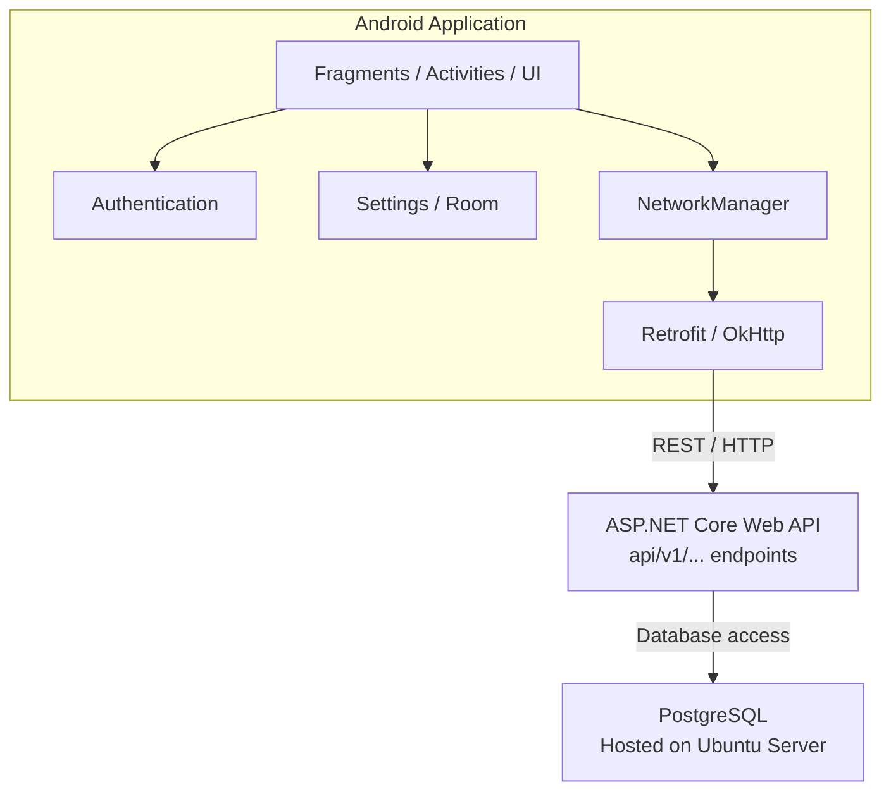
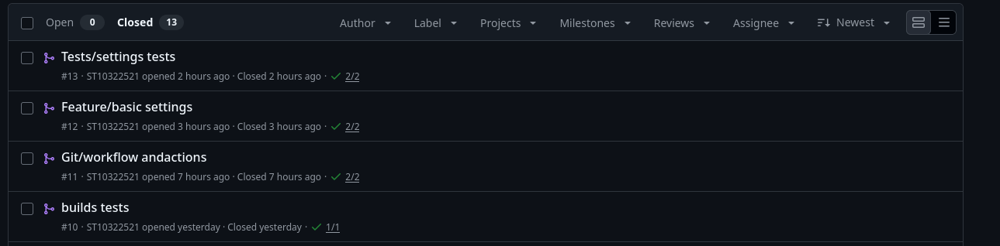

# Trinity Mobile Client

## Contributors

- James Marshall - ST10434366
- Lyle Richardson - ST10322521
- Sky Martin - ST10286905
- Simon Slingerland - ST10438897

## Project Overview

The Trinity Mobile Client is a native Android application for PROG7314 Part 2.

The application is being designed to provide a mobile interface for interacting with a remote instance/Trinity server and its connected agents. The Android client combines Firebase Authentication, local settings persistence, and RESTful API integration to provide authenticated access to current functionality.

---

## Purpose and Scope

The purpose of the Trinity Mobile Client is to create a mobile client for the Trinity System that is currently in development.

Part 2 of this project is a prototype focusing on some core features such as:

- User registration and authentication
  - Email and Password
  - Single Sign-On (SSO)

- Persistent application settings
  - Theme selection
  - Automatic application lockout during absence

- Communication with the Trinity REST API currently in development
  - Server status
  - Server information
  - Listener management
  - Task management
  - Agent command functionality
  - Remote payload configuration and build

- Logging and error handling

---

## Architecture

The project uses a layered structure that separates the Android user interface, authentication, local persistence, and network communication.

### High Level Architecture


   

[Open diagram in Mermaid Live](https://mermaid.live)


The application also has a separate local Room database that currently stores basic user-specific application preferences.

### Android Layer

The application separates packages into:

- `auth` - Firebase authentication
- `api` - REST API communication
- `database` - Room database
- `settings` - User preference management
- `model` - Application data models
- `ui` - UI-specific components

The authentication layer uses `AuthProvider` and `AuthRepository` to abstract Firebase Authentication from the UI.

The settings layer uses `SettingsRepository`, Room, and `UserPreferences` to keep user-specific settings locally.

`NetworkManager` and `ApiClient` provide the centralised REST communication.

---

## Technology Stack

**_Android:_** Kotlin, Android SDK, AndroidX, Material 3, View Binding

**_Authentication:_** Firebase Authentication, Google Identity, Credential Manager

**_Local storage:_** Room/SQLite

**_Networking:_** Retrofit, OkHttp, Gson

**_Backend:_** ASP.NET Core Web API, PostgreSQL, Ubuntu

**_Development:_** Gradle, Git, GitHub, GitHub Actions

---

## Testing and CI

Application logic is covered by automated unit tests and can be manually triggered with:

`./gradlew test`

`./gradlew assembleDebug`

GitHub Actions automatically builds and tests the project on pushes and pull requests.

---

## Version Control

The project is maintained using Git and GitHub. Feature branches are made as new features are added, and regular commits, pushes, and pull requests integrate desired changes.



---

## Demonstration

Video Demonstration:

---

## Disclosure of AI Usage

AI usage will be documented as entries using the format below:

Disclosure of AI Usage in my Assessment:

```
Sections: README file.

Name of AI tool(s) used: ChatGPT.

Purpose/intention behind use: To fix bad spelling

Date(s) in which generative AI was used: 22/09/2026

A link to the actual generative AI chat: [\[https://generic.ai/share/xyz\](https://generic.ai/share/xyz)](https://chatgpt.com/share/6ab29fc8-90fc-83ea-ad52-27d710697265)
```

```
Sections: Values/Colors

Name of AI tool(s) used: ChatGPT.

Purpose/intention behind use: To generate a light palot

Date(s) in which generative AI was used: 22/09/2026

A link to the actual generative AI chat: [\[\\[https://generic.ai/share/xyz\\](https://generic.ai/share/xyz)\](https://chatgpt.com/share/6ab29fc8-90fc-83ea-ad52-27d710697265)](https://chatgpt.com/share/6ab2a08c-bc58-83ea-bea1-4464cda5734c)
```

---
